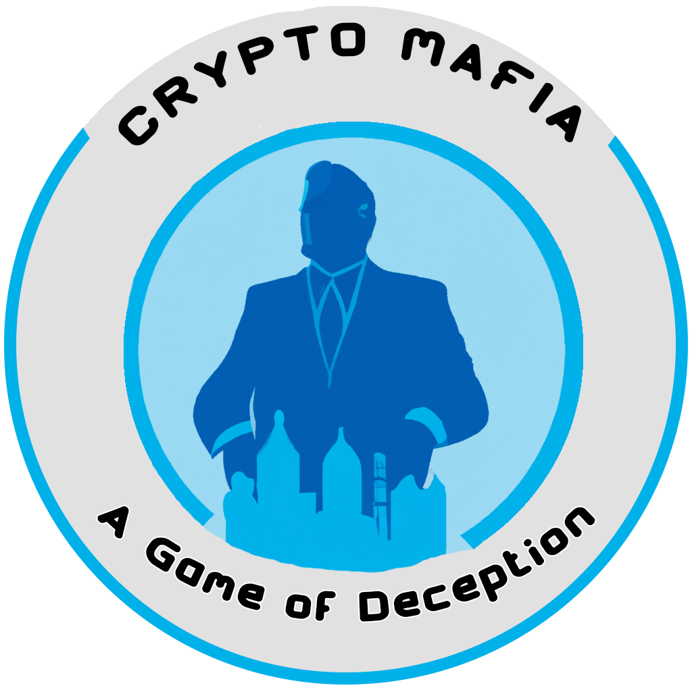

# Crypto Mafia - White Paper

A fun deception fully verifiable blockchain game. It will utilize L2 to save gas on traditional transactions. This will be non-traditional and have a web2 layer that can be utilized for ease of use.

- Mint-free on-chain villagers or mafia members (Role gives higher percentage on actual role in hosted games)
- Pay for a season pass that will give you extra access through the season and more on-chain art at the end of the games! (Season pass also comes with an extra quest)
- Stake them during mint or at any time to join the Village. Once joined you can interact with any layer 2 actions via our website. (Bridging not required!)
- Find your REDACTED and gain an advantage within the games.
- Join a risky game of Mafia (Randomly assigned roles based on villager roles and players joined) but be cautious if your character dies it will be burned
- Keep track of the histories and rankings of each character to add to the stakes of joining games and perhaps dying. All via soul bound account smart contract. No need to utilize any site to see your or anyone's histories
- Karma system - After each game players can vote for certain things players may or may not have done. This will attempt to keep people from cheating or showing bad behavior. You troll every game and eventually, your karma will dip to a level where joining ranked games and or set karma games is impossible.
- Supply based on original mints and will open periodically as players die to fill in the gaps of deaths.
- After each season supply will increase to match the demand of players that wanted in from the previous season but couldn't get in via secondary or opened supply. New traits and old traits will be retired and will be added to the on-chain art so as new seasons are created we will see new characters. This system will rely on an updatable SVG on-chain system so your character will remain on the Ethereum blockchain as long as it exists.
- Equipment and basic trait change system. As you earn more Pizzo you can change your character traits, any item earned will be bound to say token and can be removed or equipped at any time to change their looks in the real world. All attributes on the store will be unique and not available to the role. They also will be on-chain with everything else.
- Equipment binding system. Similar to many MMOs a system where you can earn new equipment or attributes for your character, but trade on the open market unless you have already equipped with the said token.
- Token-Bound certain items might be untradable, but follow tokens around if their parent token is traded on the open market.
- System to keep track of gas saved via the L2 system.
- System to keep track of and reward biggest supporters this includes royalties and any other direct support.

## Roles - Villagers

- Villager this is the most common role. They can vote and interact with anyone during the day to determine who might be the mafia taking them out. The only issue is they don't know who amoung them is also a villager or a notorius mafia member. You are trying to convince the rest of the people not to kill you, and to the mafia you are not important enough to target. Each day you will be enabled to talk. At night you can risk targeting a person to perhaps determine information about them. This should be used in caution because any Sheriff will think you are mafia, and it decreases your safety against mafia targets.

- Mayor (There is one mayor selected per game) They have no actions besides confirming the vote and being verified by everyone from the start of the game. They do have a passive ability which requires the Mafia to target all their kills in order to take him down. (Meaning if just one protection role is protecting them. They will always survive the night)

- Detective or Sheriff (1 required) only a 10% to role. Can investigate any role and determine what they are. Villagers will show up unidentified if you catch them while they are sluething though.

- Doctor or Medic (1 required) only a 10% to role. They can determine a person to protect at night. If the mafia target said person they will be protected.

- Jailor - They can block one role at night by jailing said person.

- Bodyguard 20% to role.

## Roles - Mafia

- Mafia member this is the most common mafia. They have the ability to vote together at night to decide who to kill. They know who eachother is and are attempting to trick the town during the day so they can kill enough Villagers to win the game.

- Mob Boss - There is one role and everyone knows who the mob boss is including the villagers. There special role is they get to accept the final votes for the mafia kill targets. They also can't be targeted by any special roles. (If they are the last one standing mafia lose) This role can't be in games with 20 less players.

- Escort - This member is part of the mafia and can block roles at night.

## Features

- Free L2 Gas (And full web2 intergration for anyone without web3 access)
- conversion to web3 at anytime
- Gas saved tracking
- Manager to host deception game for points.
- Leaderboard
- Communication for game
- Trade system
- Token bound and soul bound items (only after action - items can be be traded until equiped like traditional MMOs)
- Karma system to manage good in game behavior
- Fully verifable
- Staking
- Non ERC20 Tokens

## Game creation (Can change)

- Users will be provided a access token to create their own Mafia games.
- Games will be created via L2 (Immutable-X or Goerli during beta). A system on the website will manage this so interaction with this layer is not required.
- This will be all free and our system will handle any L2 fees. We will also create our own system to easily keep track of any transactions you may have submitted without the need to scan the L2 Scanner
- During beta this feature will be disabled and games will be provided by us to test and tweak how the system best should run.

## Joining Game (Can change)

- Hosted games will either be Ranked or Unranked. (Leaderboard or not)
- They can also block user based on karma levels.
- They can add a token cost to Join.
- If you have enough tokens and karma your character will join the game.
- Games do not start until they are filled up. (Games can be started by the host at 90% full)
- If game cant be started host can end game and everyone will be refunded.

## Game start

Host will be in charge of starting the game. The game won't start until it is 90% full. They need to send an array of randomized hashes that repersent each player.
This can't be in the same order they joined and is used to conceal player actions that can't be known.

The hash is then utilzes to randomly assigned classes to each player without revealing which player has been revealed. This hash needs to be added to each L2 Action a player may take. The actions come from the server and are accepted.
This is required so at the end of the game. The seed is revealed and every player can verify each step was not manurfactured and created on chain at the time of the action.
(Our website will also have a viewer to see the players once the game is over easily so verifying is much easier)

## During game

The game will continue to run until all mafia is dead or they out number the town folks. The game is seperated to a Day and Night Cycle. During the day everyone is aloud to communicate and create stratagies. The town kills up to one member they believe might be a mafia.
The day and night cycle is determined based on what the host set the time being. Standard being 24 hours for each day. 12 hours for each day/night.

Day and Night cycles can also finish early if all members do their required actions and the Mayor and Mob boss both sign off on the actions.

## Day Cycle

This cycle is for everyone. They can all chat with eachother and try to determine plan. Roled characters can state their cases and why they should be believed. The end of the cycle ends with someone dying that is the most sus. If town folk kill all the mafia then the game ends. If not the night cycle starts.

The Day cycle can end early if everyone votes and the Mayor says everything is good (If mayor is dead then the last player to vote and confirm)

## Night Cycle

This happens at the end of day and votes. If there is anyone left besides the mob boss. At night Mafia are put in a secret chat and told who eachother are. They are given time to device a stratagy and must start killing village members each night until they outnumber the town.
They have some special roles, but their biggest tool is the town folk do not know who they are while they do. They can claim sepcial roles and even out eachother to try to gain the towns trust, but all this comes at a cost. Remember once your character dies you can't play anymore. The season will open up more mints as characters die, but it does not guarntee you access. So every choice must be weighed heavily. Is dying worth it if you win the pot at the end? Do you have protections against death?

This night cycle can end early if every memember votes and does their actions, and then the Mob Boss says ok.

## Game End

The game ends when the town has killed all mafia members besides the Mob Boss - (he is hung at the end of the game) All mafia are declared losers while anyone that has survived lives and can join a new game.

The game can end for the mafia if they out number the town. Once this happens the Mayor is murdered during the next day to indicate they have taken over the village.
Any Villagers alive get to survive and live another day, but they get a loss on their record and don't win the pot.

## FAQ

#### Question 1) Free mint how to make money?

Answer 1)
We have a model where each season passes can be purchased to support the team and development. Passses give slight advantages to how much token is generated and other extra art that can be earned at the end of the season. Badges,bindable token items, and equipment items. There also will always be a season quest that won't be available with free mints

#### Question 2) I don't have a etherum wallet. Can I still play?

Answer 2) Yes, our system as a web2 intigration as long as you fill out your web2 access you will be able to get a villager if the mint is open. You can also always convert to web3 from web2.

#### Question 3) Without ERC20 token can I trade my tokens?

Answer 3) Yes, our system will offer multiple built in methods to trade with eachother. Not all methods are mentioned yet and need to be discovered or designed during season 1. We offer will eventually offer a 1 time pass with multiple tiers that offers all season passes and higher tiers got during our support phase. Will offer a way to turn the tokens into a erc721 item that gives staking rewards. These can also be sold on the normal market.

## Roadmap

- Additional browser support

- Add more integrations

- New game types
- New seasons
- New on chain art
- refined rules and roles
- new roles
- new passive things to do while staked

- New on-chain games that utilize same framework (Crypto Trails)

- Collector Passes

- Season Passes
